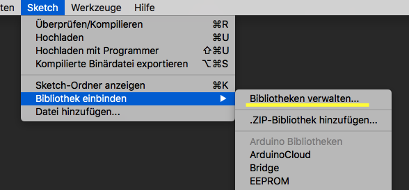

# Komponenten

Eine Sache vorweg - die meisten Komponenten sind **erheblich** günstiger wenn man sie in etwas größeren Mengen kauft. Stimmt euch da vielleicht einfach ein bisschen ab untereinander.

## Motorik

### Schrittmotoren

#### Motoren

Ein paar von euch brauchen eventuell stärkere Schrittmotoren. Wahrscheinlich werden die Motoren, die dem NEMA17 Standard entsprechen ganz gut passen:

Beispiel : [Amazon](https://www.amazon.de/NEMA-Phase-4-Draht-Stepper-Motor-3D-Drucker/dp/B06ZY9G8KG/ref=sr_1_4?ie=UTF8&qid=1526741354&sr=8-4&keywords=nema17)

#### Treiber
Für diese Motoren braucht man andere Treiberchips. Die A4988 sind dafür super geeignet. Am Besten baut ihr die aber auf einem Breadboard auf. So wie hier:

Beispiel : [Amazon](https://www.amazon.de/Popprint-A4988-Schrittmotor-Treiber-Ramps1-4-Kühlkörper-3D-Drucker/dp/B06Y28H956/ref=sr_1_1?ie=UTF8&qid=1526741529&sr=8-1&keywords=a4988)

Pro Treiber braucht ihr noch einen 100 uF Kondensator.
Beispiel : [Conrad](https://www.conrad.de/de/panasonic-eeu-fc1c101-elektrolyt-kondensator-radial-bedrahtet-25-mm-100-f-16-v-20-o-63-mm-1-st-1471207.html)

#### Anschließen

Hier ist beschrieben wie man sie anschließt. -> [Link](https://www.pololu.com/product/1182)

Der Vorteil ist, dass ihr nur eine Zeile in eurem Code ändern müsst:

AccelStepper mystepper(1, pinStep, pinDirection);

*pinStep* ist der Arduino-Pin, der mit dem STEP-Anschluss am Treiber verbunden ist.
*PinDirection* ist der Arduino-Pin, der mit dem DIR-Anschluss am Treiber verbunden ist.

#### Netzteil

Diese Motoren brauchen statt der 5V vom Arduino 12V. Was man da nehmen kann habe ich unten aufgeführt.

### DC Motoren

Hier gibt es ganz verschiedene Motoren - ich habe euch einzeln ja immer gesagt, nach was ihr grob suchen müsst. Hier Links zu ein paar Motoren.

#### Motoren

Einfacher Gleichstrommotor --> [Link](https://www.amazon.de/Yeeco-Elektrisch-Geschwindigkeit-Drehmoment-Ventilator/dp/B072KZT3X1/ref=sr_1_5?s=diy&ie=UTF8&qid=1526747528&sr=1-5)

Getriebemotor --> [Link](https://www.amazon.de/dp/B01BBSXDL2/ref=sspa_dk_detail_4?psc=1)

Schneckengetriebemotor --> [Link](https://www.amazon.de/Reversible-Hochdrehmoment-Gleichstrommotor-Geschwindigkeitsreduzierung-Elektromotor/dp/B0752T2WHC/ref=sr_1_1?s=diy&ie=UTF8&qid=1526747507&sr=1-1)

#### Treiber

Als Treiber für einen DC Motor nimmt man meist eine H-Brücke.

Beispiel : [Amazon](https://www.amazon.de/Neuftech-H-Brücke-Motortreiber-Schrittmotor-Controller/dp/B01KBTNHS6/ref=sr_1_6?ie=UTF8&qid=1526746046&sr=8-6&keywords=l298n)

Wie ihr die kontrollieren könnt ist hier aufgeführt. -> [Link](https://howtomechatronics.com/tutorials/arduino/arduino-dc-motor-control-tutorial-l298n-pwm-h-bridge/)

---

## Mechanik

### Zahnriemen

In 3D-Druckern werden vor allem GT2 Zahnriemen und -räder genutzt. Die gibt es zu einem ziemlich günstigen Preis. Der Wellendurchmesser beträgt bei den Rollen 5mm - sollte deswegen auf die meisten Motoren direkt passen.

Beispiel : [Amazon](https://www.amazon.de/Zahnriemen-Riemenscheibe-Bohrung-Riemen-Drucker/dp/B01AU3LRRG/ref=sr_1_fkmr1_1?ie=UTF8&qid=1526741082&sr=8-1-fkmr1)

Solltet ihr etwas untersetzen wollen, gibt es sie auch in anderen größen

Beispiel : [Link](https://www.amazon.de/dp/B071RM71FY/ref=twister_B071DWQ9J4?_encoding=UTF8&psc=1)

---

## Sensorik

### Ultraschall

Ein Standardsensor ist der HC-SR04. Library und Beispiele findet ihr im Library Manager (sh. unten). Ihr bekommt die Entfernung in Centimetern raus, damit könnt ihr dann arbeiten.

Beispiel : [Amazon](https://www.amazon.de/Aukru-Ultraschall-HC-SR04-Distance-Raspberry/dp/B00R2U8HK6/ref=sr_1_2?ie=UTF8&qid=1526746149&sr=8-2&keywords=ultrasonic+sensor+arduino)

### Bewegungssensor

Dafür könnt ihr den HC-SR501 nehmen.

Hier sehr ihr wie man sie nutzt: -> [Link]

Beispiel : [Amazon](https://www.amazon.de/kwmobile-Bewegungssensor-HC-SR501-digitalem-Raspberry/dp/B01LZAXUXQ/ref=sr_1_8?s=diy&ie=UTF8&qid=1526746550&sr=1-8&keywords=arduino)

---

## Beleuchtung

### LEDs

Normale 5mm LEDs könnt ihr einzeln an die Ausgänge des Arduino hängen.

**Achtung** : Für LEDs braucht ihr noch Vorwiderstände zwischen LED-Ausgang und (+) -Pol von 300 Ohm.

## Stromversorgung

Als Stromversorgung für 12V könnte ihr ein einfaches Steckernetzteil nehmen.

Beispiel : [Amazon](https://www.amazon.de/Netzteil-Netzadapter-Streifen-Lichterkette-Schlauch-12-V/dp/B01CZCXXW2/ref=sr_1_5?ie=UTF8&qid=1526741674&sr=8-5&keywords=12v+3a)

Am Besten ist es, das Kabel nicht abzuschneiden, sondern so eine Buchse zu verwenden.

Beispiel : [Amazon](https://www.amazon.de/adaptare-93520-DC-Hohlstecker-Buchse-zweipoliger-Terminal-Block/dp/B01GTGRP38/ref=sr_1_9?s=diy&ie=UTF8&qid=1526748504&sr=1-9&keywords=dc+buchse)